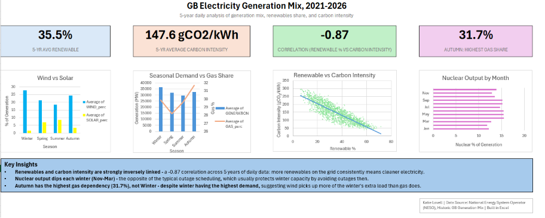
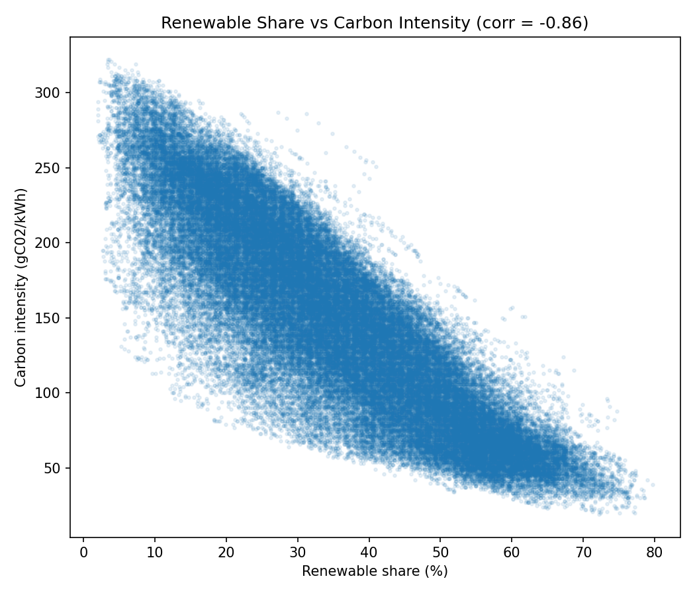
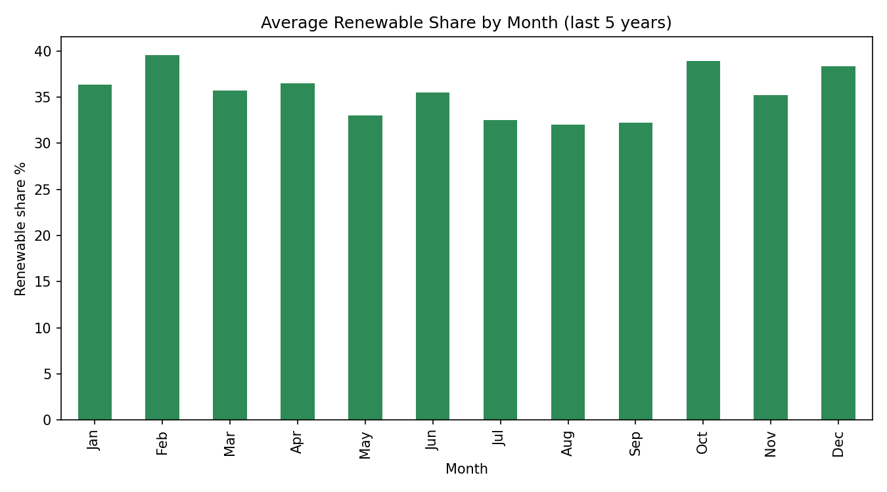

# GB Electricity Generation Mix — 5-Year Analysis (2021-2026)

## Overview
An Excel-based analysis and dashboard exploring 5 years of daily electricity generation data for Great Britain, analysing the relationship between renewable generation, carbon intensity, and seasonal demand patterns. 

## Data Source
[National Energy System Operator (NESO) — Historic GB Generation Mix](https://www.neso.energy/data-portal/historic-generation-mix), released under the NESO Open Data Licence. The full NESO dataset runs from 2009 onward; this project uses a 5-year subset (2021-2026).

## Methodology
- Structured ~1,827 days of generation-mix data (by fuel type: gas, coal, nuclear, wind, hydro, solar, biomass, etc.) in Excel
- Built pivot tables to summarise generation mix, renewable share, and carbon intensity by season and by month
- Calculated correlation between `RENEWABLE_perc` and `CARBON_INTENSITY` using Excel's `CORREL` function
- Built a scatter chart, seasonal demand/gas combo chart, and monthly nuclear-output chart to visualise patterns
- Assembled findings into a single-page dashboard with KPI summary cards

## Key Findings

**1. Renewables and carbon intensity are strongly inversely linked (r = -0.87)**
Across all 1,827 days, higher renewable generation share consistently tracked with lower carbon intensity. This is expected directionally — renewables displace fossil generation — but the strength of the correlation (close to -1) confirms just how tightly the two move together, with day-to-day variation explained by wind/solar output more than any other single factor.

**2. Nuclear output dips every winter (Nov-Mar), contrary to typical outage scheduling**
Nuclear's share of generation is consistently lower from November to March (~12-14%) than in the Apr-Sep period (~14.5-15.5%). This contradicts the general expectation that refuelling/maintenance outages are scheduled for shoulder seasons specifically to protect capacity during winter peak demand. The dataset doesn't explain *why* — possible factors could include reactor-specific reliability issues or outage clustering within this particular window — but the pattern itself is clear and consistent across the 5 years.

**3. Autumn has the highest gas dependency (31.7%), despite Winter having the highest demand**
Total demand peaks in Winter, as expected. However, gas's *share* of the generation mix peaks in Autumn, not Winter — suggesting winter's additional demand is met more by wind than by gas, while Autumn (a transitional season with typically weaker wind and solar output) relies more heavily on gas to fill the gap. This complicates the common "cold weather drives gas use" assumption and shows the value of testing it against the data directly.

## Python Cross-Check
The same analysis was independently reproduced in Python to validate the Excel findings. Correlation was calculated at two different levels of granularity — Excel's dashboard uses the daily-averaged dataset (-0.87), while the Python figure (-0.86) was calculated on the raw half-hourly data before aggregation. The near-identical result across both confirms the relationship holds regardless of aggregation level.

## Tools
Excel (pivot tables, formulas, charts, dashboard layout). Python (data analysis — script included).

## Author
Katie Lovell — Maths & Physics student, University of Liverpool.
